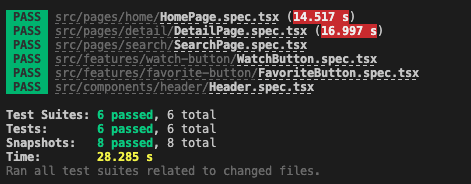

# Getting Started with Movier App

This project was bootstrapped with [Create React App](https://github.com/facebook/create-react-app).

## Demo

<video  controls>
  <source src="https://github.com/yoldasahmet/movier/blob/master/movier.mov" type="video/mp4">
</video>

<video   controls>
  <source src="./movierM.mov" type="video/mp4">
</video>

## Available Scripts

In the project directory, you can run:

### `yarn`

Install packages for project

### `yarn start`

Runs the app in the development mode.\
Open [http://localhost:3000](http://localhost:3000) to view it in the browser.

The page will reload if you make edits.\
You will also see any lint errors in the console.

### `yarn test`

Launches the test runner in the interactive watch mode.\
See the section about [running tests](https://facebook.github.io/create-react-app/docs/running-tests) for more information.

